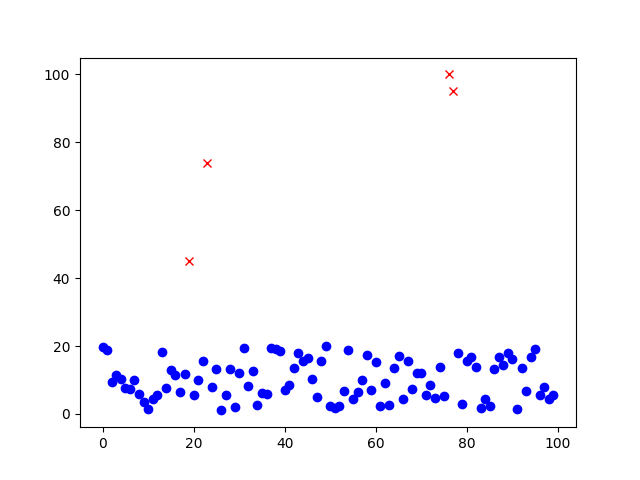
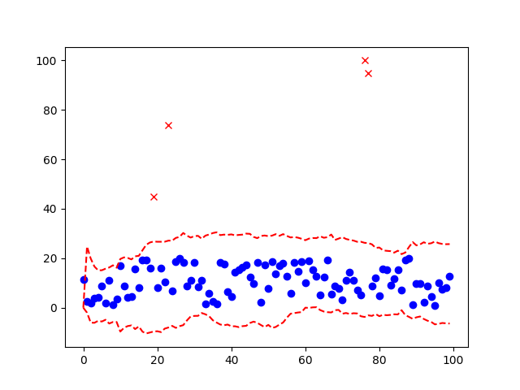

# StreamOutlierDetector
Detect outliers of sequence in stream.  
In this project we have some assumption:
-   This project works online that means has no idea about the future data
-   This project forget older data (more than size of sample array)
-   If more than half of sample array be in outlier then this project assume the majority is not outlier and calculate outlier detection for the sample again


### Usage
I do not publish it in the pip yet ☹️

```python
from src.OutlierDetector import OutlierDetector

outlier_detector = OutlierDetector(bound_factor_standard_deviation=3, size_current_sample=20, size_initial_ignore=10)

is_outlier = outlier_detector.push(your_value)
```

if you want, you can use it with callback function
```python
from src.OutlierDetector import OutlierDetector

def result(is_outlier):
    print(is_outlier)

outlier_detector = OutlierDetector(bound_factor_standard_deviation=3, size_current_sample=20, size_initial_ignore=10)

is_outlier = outlier_detector.push(value=your_value, callback=result)
```

## Result
I test this class and show the functionality of it on a chart.  
<span style="color:red">x</span> are the outliers we detect.  
<span style="color:blue">🔵</span> are the normal values.  
<span style="color:red">-</span> are the bound of outlier detection.  

Without bound                           | With bounds
----------------------------------------| ------------------------------ 
   |  


 

